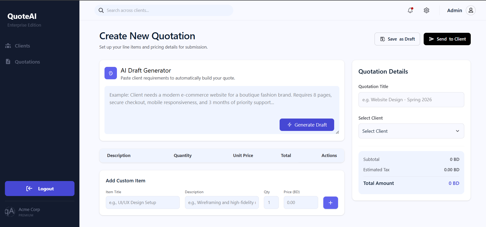
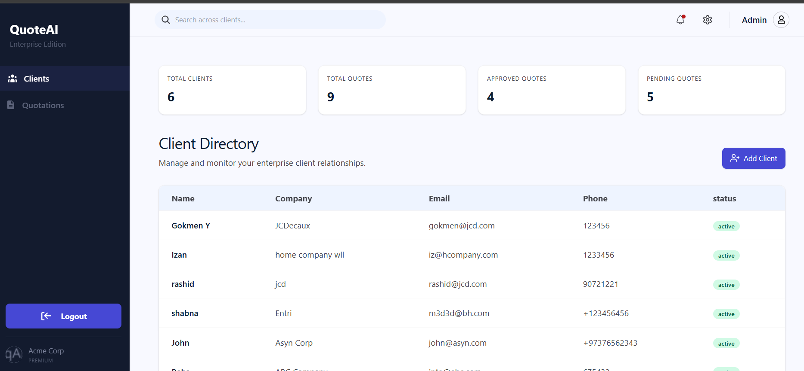
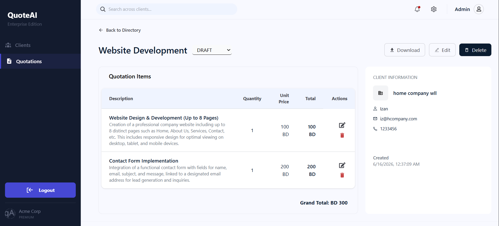

#  AI-Assisted Quotation Builder

## 🔗 Live Demo

- https://ai-assisted-quotation-builder.vercel.app/

- Backend : https://ai-assisted-quotation-builder.onrender.com/

## Test user : 

- "email":"admin@example.com",
- "password":"password123"

### AI prompt Used - server/prompts/quotation-draft.md

## 📖 Description

AI-Assisted Quotation Builder is a modern CRM-style application that helps businesses manage clients and quotations efficiently. By leveraging AI-generated suggestions and workflow automation through n8n, the application reduces manual work and improves operational efficiency.

## ✨ Features

- Secure user authentication and authorization using JWT-based authentication.
- Create and manage quotations easily
- Client management (add, edit, delete clients)
- Add multiple items per quotation
- AI-assisted suggestions for quote generation (pricing, descriptions, etc.)
- Automatic total calculation for quotes
- Real-time quote updates
- Search and filter quotes
- Export quotes
- Authentication & secure access
- Responsive UI for all devices

## 🛠️ Technologies Used

- **Frontend:** React.js
- **Backend / Database:** Node.js, Express.js, MongoDB
- **Authentication & Security:** JWT (JSON Web Tokens), bcrypt (password hashing)
- **AI Tool:** Gemini API
- **Styling:** CSS3 & Tailwind CSS
- **Libraries:** react-Router-Dom, react-icons,react-toastify,react-to-print,React-Redux
- **Version Control:** Git & GitHub
- **Deployment:** Vercel (FrontEnd), Render(Backend)

## 🚀 Setup Instructions

### Prerequisites
- Node.js (v14 or higher)
- npm or yarn

### Installation Steps
1. Clone the repository
- git clone https://github.com/Shabnapm99/AI-Assisted-Quotation-Builder.git
- Navigate to project directory 
- Backend - cd server
- FrontEnd - cd client

2. Install dependencies 
- npm install - on both client and server directory
3. Configure Environment Variables

- Create a .env file inside the server folder and add:

MONGODB_URI =your_mongodb_connection_string
JWT_TOKEN=your_secret_key
PORT=4000
JWT_EXPIRESIN = "expiry-time"
GEMINI_API_KEY=gemini-api-key
FRONTEND_URL='http://localhost:5173'
N8N_WEBHOOK_URL = n8n webhook url

- Create a .env file inside the client folder and add:

VITE_BASE_URL="http://localhost:4000/"

4. Start development server 
- npm start - Backend
- npm run dev - FrontEnd

5. Open http://localhost:5173/ &in your browser
6. Set up n8n webhook to get discord notification when a user clicks approved.

## 📱 Responsive Design
This application is fully responsive and tested on:
- Mobile devices (375px and up)
- Tablets (768px and up)
- Desktop (1024px and up)

## 📸 Screenshots

| Dashboard | Create Quote | Details |
|----------|-------------|---------|
|  |  |  |

## Approach

This project is a full-stack quotation management application built to make creating and managing quotations faster and more efficient.

Users can log in with a seeded test account and manage clients, quotations, and quotation items through a simple and intuitive dashboard. To reduce manual effort, the application integrates the Google Gemini API, which can suggest quotation items based on user input, helping users generate quotations more quickly.

The project also includes workflow automation using n8n. When a quotation's status is updated to "Approved", a notification is automatically sent to Discord, demonstrating how business processes can be streamlined through automation.

## 🔮 Future Enhancements

- Search and filter options on clients and quotations
- Improve security with refresh tokens, stricter input validation, and API protection measures.
- Basic tests for total calculation or AI validation. 
- Bilingual quotation support (English/Arabic). 
- Improve UI/UX
- advanced n8n integration such as Email delivery of quotes directly from the app
- PDF export with branding
- Email quotation directly to clients
- Advanced analytics dashboard
- Multi-user role support (Admin / Sales / Manager)
- AI-based pricing optimization

## 👤 Author
### Shabna PM
- GitHub: https://github.com/Shabnapm99
- LinkedIn: https://www.linkedin.com/in/shabnapm/

